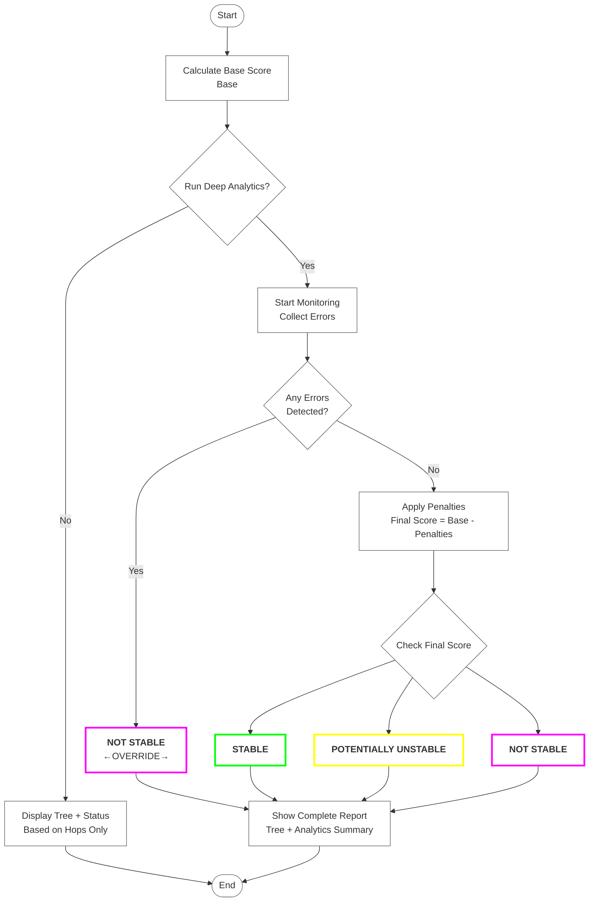

# Kangche ProAV Shōko - your ProAV detective<br> 証拠 - Shōko - Proof / Evidence / Clarity

- Analyze, verifiy, and **exposes device or connection issues** in meeting rooms and BYOD setups.
- No excuses. No guessing. Just proof.
- Inspection / analysis / evidence


Windows:
```powershell
irm https://raw.githubusercontent.com/klangche/klangche-proav-shoko/main/proav-shoko.ps1 | iex
```


## HOW TO USE THE TOOL
1. Copy and Paste above command into **PowerShell** 
2. Run in admin och basic*
3. view result
4. view result in browser (copy-paste ready)
5. if in admin run deep analytict**


*not supported on all systems<br>
**not available in OSX nor Linux without powershell.

A lightweight USB diagnostics tool to quickly visualize USB tree structure, count hops/tiers, and assess chain stability — especially useful in corporate BYOD meeting rooms and AV setups.

# Why this tool matters in AV environments
In modern conference rooms we often see:
- USB-C docks (Unisynk, HP, Lenovo, Caldicit, Logitech, TiGHT, Hyper, Targus etc..)
- Multiple hubs daisy-chained
- Webcams, speakerphones, touch panels, wireless presentation dongles, external drives
- iPads/iPhones/Android devices brought by users

Long chains frequently cause problems **only on Apple Silicon Macs** (M1/M2/M3/M4), while Windows and Intel Macs usually work fine.  
This tool helps technicians prove:  
→ "The chain has 5 hops → Windows & Intel OK, but Apple Silicon not stable"

*# Target audience**  
- Everyday users who needs troubleshooting or sending IT a proper report.
- Technicians and sales people who need to share clear, professional diagnostics
- Diagnistics team
- IT to verify that the system works with system setups
- POC hard-testing.

## Windows version – what it can do
- Shows full hierarchical USB tree with exact hop counts from root
- Marks hubs clearly [HUB]
- Calculates furthest hop distance and total tiers
- Gives per-platform stability verdict (green/orange/pink) with Apple Silicon emphasis
- Produces beautiful black-background HTML report (looks identical to terminal)
- **Deep Analytics mode** (admin only): real-time monitoring of USB connect/disconnect events, re-handshakes, random errors
- Asks smart questions only once: admin? open report?

# Where macOS and Linux versions do NOT support (yet)
No real-time Deep Analytics / event monitoring (macOS would need log stream, Linux journalctl — not implemented)
macOS tree is good but less precise hop counting than Windows registry method
Linux needs usbutils package + sudo for full tree (no auto-elevation like PowerShell)
No automatic "re-launch as admin" on macOS/Linux (manual sudo)

For AV field use we still recommend Windows laptop as primary diagnostic station — most reliable experience.
Questions / feature requests → open issue.

# Script structure
```
Repository: klangche/usb-script
├── proav-shoko.ps1                  # Powershell launcher
├── proav-shoko_powershell.ps1       # Windows script
├── proav-shoko.sh                   # macOS script 
└── roav-shoko.json                  # Central configuration
```


### Rating logic



