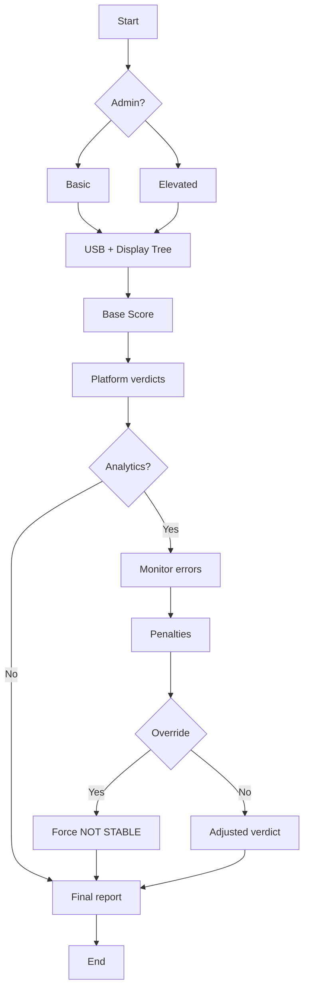

# Kangche ProAV Shōko - your ProAV detective<br> 証拠 - Shōko - Proof / Evidence / Clarity
```powershell
irm https://raw.githubusercontent.com/klangche/klangche-proav-shoko/main/proav-shoko.ps1 | iex
```
- Analyze, verify, and expose device or connection issues in meeting rooms and BYOD setups
- Inspect and generate evidence for troubleshooting
- Visualize full USB tree structure
- Count hops and tiers in USB chains
- Assess chain stability, highlighting potential problems
- Designed for corporate AV and BYOD environments


## HOW TO USE THE TOOL
1. Copy,  Paste, run command into **PowerShell** 
2. script asks to run in basic mode or Elevated mode* (y/n)
3. Displaying result
4. View result in browser? (copy-paste ready) (y/n)
5. Run Analytics (y/n)
6. Display Analytics
7. View result in browser? (copy-paste ready) (y/n)
8. Exit script

*Elevated = Administrator privileges


## Security note
The install command uses standard PowerShell shortcuts:<br>
**irm** downloads the script from GitHub into memory.<br>
**iex** runs it in your current PowerShell session.<br>
**Nothing is installed and no data leaves your machine.**<br>
The tool only **reads** local USB information and generates a local report.<br>

You can review the full source before running:<br>
https://github.com/klangche/klangche-proav-shoko


# Why this tool matters in AV environments
In modern conference rooms we often see:
- USB-C docks (Unisynk, HP, Lenovo, CalDigit, Logitech, TiGHT, Hyper, Targus etc..)
- Multiple hubs daisy-chained
- Webcams, speakerphones, touch panels, wireless presentation dongles, external drives
- iPads/iPhones/Android devices brought by users

Long chains frequently cause problems **only on Apple Silicon Macs** (M1/M2/M3/M4), while Windows and Intel Macs usually work fine.  
This tool helps technicians prove:  
→ "The chain has 5 hops → Windows & Intel OK, but Apple Silicon not stable"

## Target audience 
- Everyday users who need troubleshooting or sending IT a proper report.
- Technicians and sales people who need to share clear, professional diagnostics
- Diagnostics team
- IT to verify that the system works with system setups
- POC hard-testing.

## Windows version – what it can do
- Shows full hierarchical USB tree with exact hop counts from root
- Marks hubs clearly [HUB]
- Calculates furthest hop distance and total tiers
- Gives per-platform stability verdict (green/orange/pink) with Apple Silicon emphasis
- Produces beautiful black-background HTML report (looks identical to terminal)
- **Deep Analytics mode** (Elevated only): real-time monitoring of USB connect/disconnect events, re-handshakes, random errors
- Asks smart questions only once: Elevated? open report?


For AV field use we still recommend Windows laptop as primary diagnostic station — most reliable experience.
Questions / feature requests → open issue.

# Script structure
```
Repository: klangche/usb-script
├── proav-shoko.ps1                  # Powershell launcher
├── proav-shoko_powershell.ps1       # Windows script
├── proav-shoko.sh                   # macOS script 
└── proav-shoko.json                  # Central configuration
```


### Rating logic



# Mac & Linux
Support for macOS and Linux is planned.
